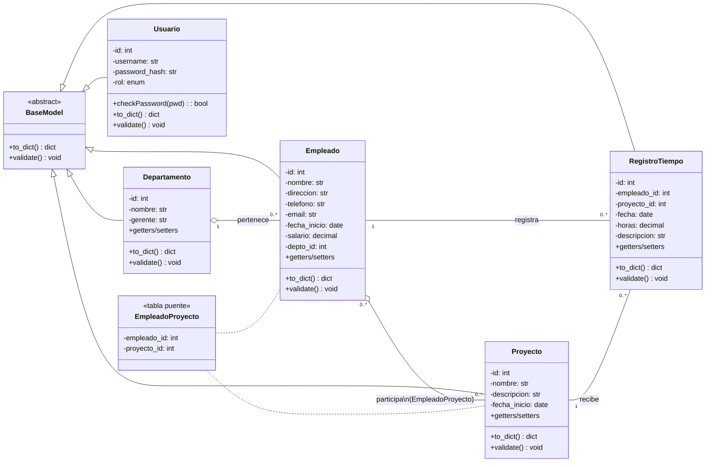

# UML del Sistema (POO + MySQL + CLI)

## Notas de diseño (para explicar en la defensa)

- **Herencia y polimorfismo**: todas las entidades extienden `BaseModel` y sobreescriben `validate()` y `to_dict()`.
- **Encapsulamiento**: atributos privados con `__atributo` y acceso mediante `@property`.
- **Relaciones**:
  - `Departamento 1 — * Empleado` (empleado tiene `depto_id`).
  - `Empleado * — * Proyecto` vía tabla puente `EmpleadoProyecto`.
  - `RegistroTiempo` es una asociación entre `Empleado` y `Proyecto` con atributos propios (`fecha`, `horas`, `descripcion`).
- **Usuario** no se relaciona directamente con el modelo de negocio; controla **autenticación y rol** para la **CLI**.
